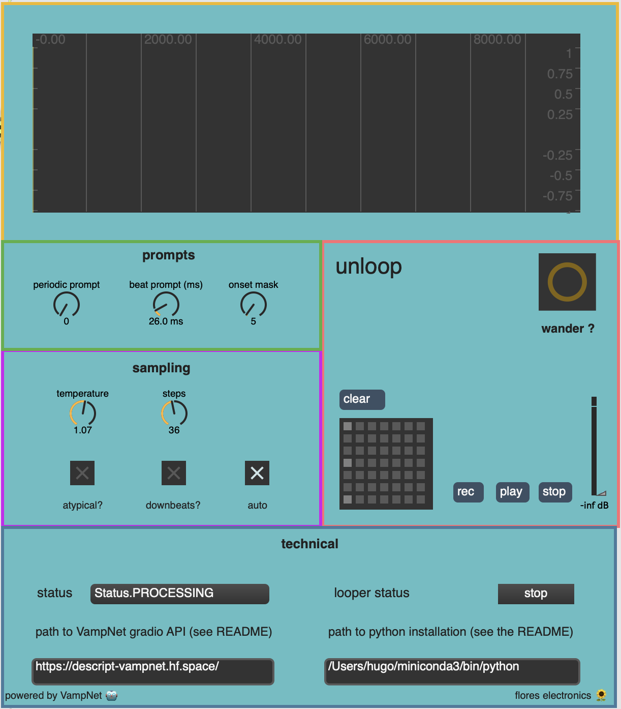
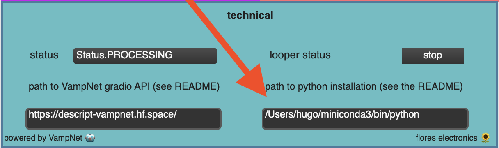

# unloop



unloop is a co-creative looper that uses generative modeling to **not** repeat itself.

watch a demo video here: [https://youtu.be/yzBI8Vcjd2s](https://youtu.be/yzBI8Vcjd2s). 

unlooper leverages the power of [VampNet](https://hugo-does-things.notion.site/VampNet-Music-Generation-via-Masked-Acoustic-Token-Modeling-e37aabd0d5f1493aa42c5711d0764b33), a masked generative model for music, to generate variations of loop a musician has recorded, creating a more interactive and fun experience than using a traditional looper. 


## Setup 

unloop is a Max patch, but it requires python to contact the [huggingface space](https://huggingface.co/spaces/descript/vampnet) that hosts the VampNet model to generate the variations. 

you will need to install the following max externals s well: [karma](https://github.com/rconstanzo/karma/tree/master) and [shell](https://github.com/jeremybernstein/shell). 


First, clone the repo
```bash
git clone https://github.com/hugofloresgarcia/unloop.git
cd unloop
```

`unloop` requires Python 3 to be installed on your computer. 

Then, install the local python package called `unloop`. 
```bash
python -m pip install -e .
```

You'll need to keep track of where your python installation is, so copy the output of the following command:
```bash
which python
```

Your python path will look like this: `/some/path/to/bin/python`. Copy that string! You'll need it later.


## Usage

`unloop` is a Max patch, meaning that you'll need to open it using [Max MSP](https://cycling74.com/downloads).

to open `unloop`, simply open `unloop.maxpat` using Max.

**NOTE**: you'll need to know the path to the Python installation where you installed the `vamp` package. You'll need to enter this path in the max patch. 



Once you've done this, you're all set! Refer to the demo video for a [usage example](https://youtu.be/yzBI8Vcjd2s). 
