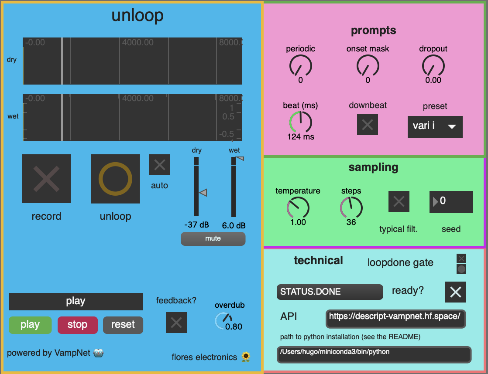

# unloop



unloop is a looper that uses generative modeling to **not** repeat itself.

unlooper leverages the power of [VampNet](https://hugo-does-things.notion.site/VampNet-Music-Generation-via-Masked-Acoustic-Token-Modeling-e37aabd0d5f1493aa42c5711d0764b33), a masked generative model for music, to generate variations of loop a musician has recorded, creating a more interactive and fun experience than using a traditional looper. 


## Setup 

unloop is a Max patch, but it requires python to contact the [huggingface space](https://huggingface.co/spaces/descript/vampnet) that hosts the VampNet model to generate the variations. 

First, clone the repo
```bash
git clone https://github.com/hugofloresgarcia/unloop.git
cd unloop
```


Then, install the local python package. 
```bash
pip install -e .
```

**NOTE**: you'll need to know the path to the Python installation where you installed the vamp package. You'll need to enter this path in the max patch. 


Once you've done this, you're all set! Refer to the demo video for a [usage example](). 